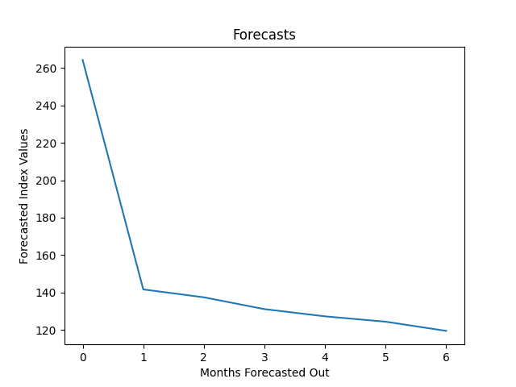

# Wichita Home Forecasting

Extremely simple forecasting model for evaluating home price trends in Wichita, KS.

I used this several years ago to do a quick evaluation if the Wichita housing market would go up or down during COVID. The results have been updated for the data as of May 2023. 



As you can see, based on the market data used, the model is currently predicting a rather severe downward trend in the market. However, given the exponential growth of the housing prices due to other factors beyond the market data originally contained in this model, this is probably gross overestimation of the market correction. 

The last time that I used the model, the housing prices were behaving within the norm, without large growth (aprox. 2020/2021).

# Future Work
When I take this forward next time, I will include a more complex machine learning model as well as identify additional crucial features as well as use additional stationarity tests and better forecasting algorithms.

# MarketData.py

The `MarketData.py` file contains one of my methodologies for interacting and formatting data from the Federal Reserve API system (named FRED). [Source](https://fred.stlouisfed.org/series/ATNHPIUS48620Q)

This class takes a FRED key and uses a dictionary (such as the one below) to extract the required fields from the FRED API. 

```
{
    "House Price Index, Wichita": "ATNHPIUS48620Q",
    "Smoothed US Recession Probabilities": "RECPROUSM156N",
    "30 Year Fixed Mortgage Rate Average": "MORTGAGE30US",
    "Delinquency Rate Overall": "DRSFRMACBS"
}

```

### Example usage:

Using the dictionary above to extract, parse, and download data from the Federal Reserve.

```
series_ids = load_yaml(os.path.abspath("./bls_series.yaml"))
fred = FredQuery(get_bls_key())

# get the market data from the federal reserve
fred.get_market_data_df(series_ids['BLS_SERIES'], resample="Q")

fred.plot_market_data()

market_data = fred.market_data_df()
```
